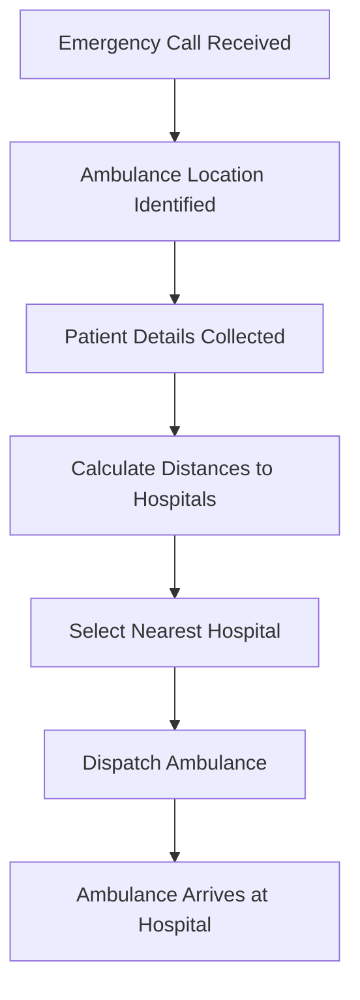
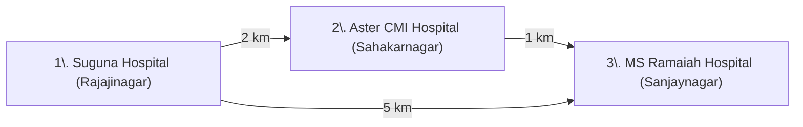

## Dynamic Ambulance Dispatch System (DADS)

This project is a Dynamic Ambulance Dispatch System designed to efficiently allocate ambulance resources during emergencies and facilitate patient admissions to hospitals based on various factors such as casualties, road conditions, and patient details.

The main objectives of this system are:

1. Emergency Response Optimization: To swiftly identify the nearest hospital to an emergency location, considering factors like road conditions and casualties.

2. Patient Admission Management: To manage patient admissions to hospitals based on their proximity, available resources, and severity of their condition.

3. Efficient Resource Allocation: To optimize the allocation of ambulance resources by determining the shortest routes and optimal hospitals for patient treatment.

4. Data Management: To maintain a record of patient details, including their name, age, medical history, and contact information, for effective communication and follow-up.

5. User Interface: To provide a user-friendly interface for emergency responders to input emergency details, select hospitals, and manage patient admissions.

The system utilizes graph algorithms like Dijkstra's and Floyd-Warshall to calculate shortest paths and optimal routes between emergency locations and hospitals. It also employs linked lists and file I/O operations for efficient data storage and retrieval.

Overall, this project aims to enhance emergency response efficiency and improve patient care by leveraging technology to streamline ambulance dispatch and hospital admissions processes.

---

## Visual Overview

### System Flowchart



### Hospital Network Diagram



### Api Network Diagram

```mermaid
flowchart TD
    A[User (Browser)]
      -->|Interacts| B[Next.js Frontend<br/>(Bootstrap UI)]
    B -->|API Requests (REST/HTTP)| C[C Backend API<br/>(Dynamic Ambulance Dispatch System)]
    C -->|Data| B
    B -->|UI Updates| A


```

---

## Features

- **Shortest Path Calculation:** Uses Floyd-Warshall algorithm to compute shortest paths between all hospitals.
- **Dynamic Hospital Selection:** Selects the nearest hospital based on ambulance location and hospital capacity.
- **Test Suite:** Includes assert-based C tests for core logic.

---

## File Structure

- `Project_ambu/hospital_final.c` — Main logic for hospital selection and dispatch
- `Project_ambu/test_hospital.c` — Unit tests for shortest path and selection logic
- `Project_ambu/hospital_names.txt` — List of hospitals
- `Project_ambu/weights.txt` — Distance matrix between hospitals
- `Project_ambu/patient_details.txt` — Simulated patient data
- `Project_ambu/casualtiesMatrix.txt` — Matrix of casualties (if applicable)
- `frontend` -- basic next app based front end to be user friendly
---

## Usage Instructions

### 1. Compile the Project

```bash
gcc Project_ambu/hospital_final.c -o Project_ambu/hospital_final.exe
```

### 2. Run the Main Program

```bash
./Project_ambu/hospital_final.exe
```

### 3. Run the Tests

```bash
gcc Project_ambu/test_hospital.c -o Project_ambu/test_hospital
./Project_ambu/test_hospital
```
### 4. Install Mongodb

```bash
wget -qO - https://www.mongodb.org/static/pgp/server-6.0.asc | sudo apt-key add -
echo "deb [ arch=amd64,arm64 ] https://repo.mongodb.org/apt/debian bullseye/mongodb-org/6.0 main" | sudo tee /etc/apt/sources.list.d/mongodb-org-6.0.list
sudo apt update
sudo apt install -y mongodb-mongosh
```
### 5. Import Stored data


```bash
cd frontend
cp .env.example .env
mongorestore --db=healthapp --collection=Hospital src/data/healthapp/Hospital.bson
mongorestore --db=healthapp --collection=patients src/data/healthapp/patients.bson
mongorestore --db=healthapp --collection=Users src/data/healthapp/Users.bson
```
### 6. Run frontend

```bash
npm install
npm run dev
```
---
### 7. To update the data

```bash
mkdir -p src/data/healthapp
mongodump --db=healthapp --collection=Hospital --out=src/data
mongodump --db=healthapp --collection=patients --out=src/data
mongodump --db=healthapp --collection=Users --out=src/data
```
## How It Works


1. **Ambulance Receives Emergency Call:**
   - The system identifies the ambulance's current location.
2. **Patient Details Collected:**
   - Information such as severity, location, and requirements are gathered.
3. **Distance Calculation:**
   - The system calculates the shortest path from the ambulance to all hospitals using the Floyd-Warshall algorithm.
4. **Hospital Availability & Routing:**
   - System checks MongoDB for hospital statuses (beds, ICU, ventilator availability).
   - Selects the nearest suitable hospital with real-time capacity.
5. **Ambulance Dispatched:**
   - The ambulance is routed to the selected hospital.
6. **Ambulance & Location Analysis:**
   - The system fetches real-time ambulance positions.
   - Uses Floyd-Warshall algorithm to calculate shortest paths to hospital
7. **Live Monitoring & Feedback:**
   - Admin views ongoing cases via Distress Center.
   - Operators can send real-time feedback or flag delays/issues.

---

## Data BackBone
**All the above logic is now supported by:**

  - Modular MongoDB CRUD routes for all core entities (Hospitals, Patients, Users, Ambulances).

  - Dynamically updated data synced with user dashboards.


## Contributing

1. Fork the repository
2. Create a new branch (`git checkout -b feature-branch`)
3. Commit your changes
4. Open a pull request

---

## License

This project is open-source and available under the MIT License.

---

## Contact

For questions or suggestions, please open an issue or contact the maintainer.
